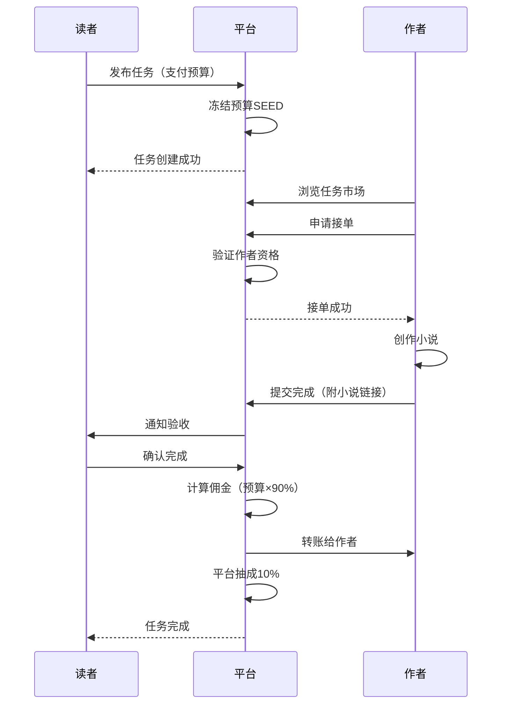
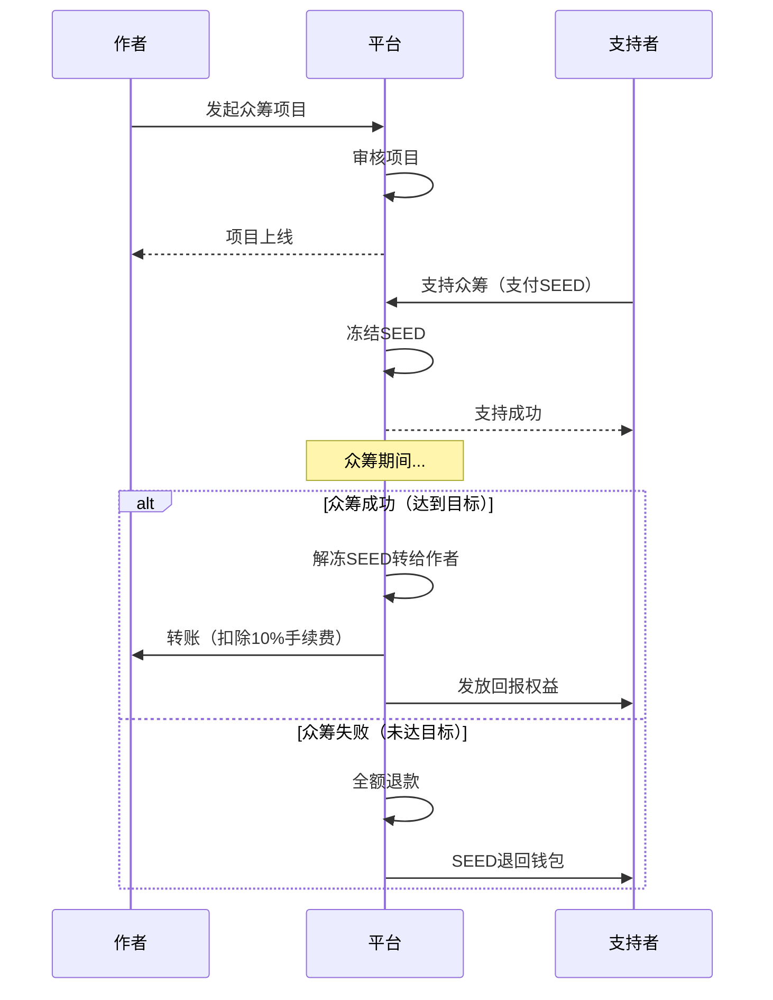

# FireSeed 经济体系升级方案

> 版本：2.0  
> 日期：2026-06-10  
> 目标：整合读者发布任务 + 作者接单 + 众筹小说功能

---

## 一、现状分析

### 1.1 现有经济系统

**核心机制**：
- SEED（星火币）作为平台唯一货币
- 每日固定产出上限：10,000 SEED
- 平台交易抽成：10%
- 平台收入销毁：50%
- 新用户注册赠送：100 SEED
- 发布小说奖励：100 SEED
- 发布章节奖励：10 SEED

**数据表**：
- `wallets` - 用户钱包
- `transactions` - 交易记录
- `skill_missions` - 技能任务（已有雏形）
- `crowdfunding_projects` - 众筹项目（已存在但未启用）
- `crowdfunding_supporters` - 众筹支持者（已存在但未启用）

### 1.2 存在的问题

1. **任务系统不完善**：skill_missions表缺少发布者、预算、状态等关键字段
2. **众筹功能未启用**：表结构存在但无API和前端实现
3. **经济闭环缺失**：读者消费SEED的场景有限，作者获取SEED的渠道单一
4. **激励机制不足**：缺乏读者→作者的直接价值传递通道

---

## 二、升级目标

### 2.1 核心功能

#### 功能1：读者发布小说任务（Task Marketplace）
- 读者可以发布小说创作需求（题材、字数、风格等）
- 设置任务预算（SEED支付）
- 作者浏览任务市场并接单
- 作者完成任务后获得SEED奖励
- 平台抽取10%手续费

#### 功能2：众筹小说（Crowdfunding）
- 作者发起小说众筹项目
- 设定目标金额和截止日期
- 读者支持众筹（SEED支付）
- 众筹成功后作者获得资金并开始创作
- 支持者获得专属权益（早期阅读、署名感谢等）
- 众筹失败则全额退款

### 2.2 经济循环设计

```
读者发布任务 → 支付SEED → 平台抽成10% → 作者接单完成 → 获得90% SEED
                                                    ↓
                                            作者使用SEED
                                                    ↓
                                    ┌───────────────┴───────────────┐
                                    ↓                               ↓
                            支持众筹项目                    购买VIP/道具
                                    ↓                               ↓
                            其他作者获得资金              平台回收SEED
                                    ↓                               ↓
                            创作新小说 → 吸引读者              通缩机制
```

**关键指标**：
- 任务市场流通量：预计日均50-100个任务
- 众筹项目成功率：目标60%以上
- SEED日周转率：提升3-5倍
- 作者月收入：目标500-2000 SEED/月

---

## 三、数据库设计

### 3.1 任务系统表结构

#### 新增表：novel_tasks（小说任务）

```sql
CREATE TABLE IF NOT EXISTS novel_tasks (
  id TEXT PRIMARY KEY,
  publisher_id TEXT NOT NULL,           -- 发布者（读者）
  title TEXT NOT NULL,                  -- 任务标题
  description TEXT NOT NULL,            -- 任务描述
  genre TEXT,                           -- 题材分类
  target_words INTEGER,                 -- 目标字数
  budget INTEGER NOT NULL,              -- 预算（SEED）
  deadline DATETIME NOT NULL,           -- 截止时间
  status TEXT DEFAULT 'open',           -- open/assigned/completed/cancelled/expired
  assignee_id TEXT,                     -- 接单人（作者）
  assigned_at DATETIME,                 -- 接单时间
  completed_at DATETIME,                -- 完成时间
  delivery_url TEXT,                    -- 交付链接（小说ID）
  rating INTEGER,                       -- 评分（1-5）
  review TEXT,                          -- 评价
  created_at DATETIME DEFAULT CURRENT_TIMESTAMP,
  updated_at DATETIME DEFAULT CURRENT_TIMESTAMP,
  FOREIGN KEY (publisher_id) REFERENCES users(id),
  FOREIGN KEY (assignee_id) REFERENCES users(id)
);

CREATE INDEX idx_tasks_status ON novel_tasks(status, deadline);
CREATE INDEX idx_tasks_publisher ON novel_tasks(publisher_id);
CREATE INDEX idx_tasks_assignee ON novel_tasks(assignee_id);
```

#### 修改表：skill_missions（补充字段）

```sql
ALTER TABLE skill_missions ADD COLUMN publisher_id TEXT;
ALTER TABLE skill_missions ADD COLUMN budget INTEGER DEFAULT 0;
ALTER TABLE skill_missions ADD COLUMN assignee_id TEXT;
ALTER TABLE skill_missions ADD COLUMN status TEXT DEFAULT 'active';
ALTER TABLE skill_missions ADD COLUMN completed_at DATETIME;
```

### 3.2 众筹系统增强

#### 修改表：crowdfunding_projects（补充字段）

```sql
ALTER TABLE crowdfunding_projects ADD COLUMN min_support_amount INTEGER DEFAULT 10;
ALTER TABLE crowdfunding_projects ADD COLUMN stretch_goals TEXT DEFAULT '[]';  -- 阶梯目标
ALTER TABLE crowdfunding_projects ADD COLUMN updates_count INTEGER DEFAULT 0;  -- 更新次数
ALTER TABLE crowdfunding_projects ADD COLUMN success_stories TEXT DEFAULT '';  -- 成功案例
```

#### 新增表：crowdfunding_updates（众筹更新）

```sql
CREATE TABLE IF NOT EXISTS crowdfunding_updates (
  id TEXT PRIMARY KEY,
  project_id TEXT NOT NULL,
  title TEXT NOT NULL,
  content TEXT NOT NULL,
  created_at DATETIME DEFAULT CURRENT_TIMESTAMP,
  FOREIGN KEY (project_id) REFERENCES crowdfunding_projects(id)
);

CREATE INDEX idx_crowdfunding_updates ON crowdfunding_updates(project_id, created_at);
```

#### 新增表：crowdfunding_rewards（众筹回报）

```sql
CREATE TABLE IF NOT EXISTS crowdfunding_rewards (
  id TEXT PRIMARY KEY,
  project_id TEXT NOT NULL,
  tier_name TEXT NOT NULL,              -- 档位名称（如"支持者"、"铁杆粉丝"）
  min_amount INTEGER NOT NULL,          -- 最低支持金额
  benefits TEXT NOT NULL,               -- 权益描述（JSON数组）
  limit_count INTEGER DEFAULT 0,        -- 限量（0为不限）
  claimed_count INTEGER DEFAULT 0,      -- 已领取数量
  FOREIGN KEY (project_id) REFERENCES crowdfunding_projects(id)
);

CREATE INDEX idx_crowdfunding_rewards ON crowdfunding_rewards(project_id, min_amount);
```

### 3.3 交易类型扩展

在transactions表中增加新的type值：

- `task_publish` - 发布任务（扣款）
- `task_complete` - 完成任务（收款）
- `task_refund` - 任务退款
- `crowdfunding_support` - 支持众筹（扣款）
- `crowdfunding_success` - 众筹成功（作者收款）
- `crowdfunding_refund` - 众筹失败退款

---

## 四、API设计

### 4.1 任务系统API

#### 发布任务
```
POST /api/tasks/novel
Body: {
  title: string,
  description: string,
  genre?: string,
  target_words?: number,
  budget: number,
  deadline: string  // ISO date
}
Response: { success: true, task_id: string }
```

#### 浏览任务市场
```
GET /api/tasks/novel?status=open&genre=科幻&page=1&limit=20
Response: { 
  success: true, 
  tasks: NovelTask[], 
  total: number,
  page: number 
}
```

#### 查看任务详情
```
GET /api/tasks/novel/:taskId
Response: { success: true, task: NovelTask }
```

#### 接单
```
POST /api/tasks/novel/:taskId/assign
Response: { success: true }
```

#### 提交完成
```
POST /api/tasks/novel/:taskId/complete
Body: { delivery_url: string }
Response: { success: true }
```

#### 确认完成并支付
```
POST /api/tasks/novel/:taskId/confirm
Response: { success: true, amount_received: number }
```

#### 取消任务
```
POST /api/tasks/novel/:taskId/cancel
Response: { success: true, refund_amount: number }
```

#### 评价任务
```
POST /api/tasks/novel/:taskId/rate
Body: { rating: number, review?: string }
Response: { success: true }
```

### 4.2 众筹系统API

#### 发起众筹
```
POST /api/crowdfunding/create
Body: {
  title: string,
  description: string,
  target_amount: number,
  deadline: string,
  rewards: Array<{tier_name, min_amount, benefits, limit_count}>
}
Response: { success: true, project_id: string }
```

#### 浏览众筹项目
```
GET /api/crowdfunding/list?status=active&sort=newest&page=1&limit=20
Response: { 
  success: true, 
  projects: CrowdfundingProject[], 
  total: number 
}
```

#### 查看众筹详情
```
GET /api/crowdfunding/:projectId
Response: { 
  success: true, 
  project: CrowdfundingProject,
  rewards: CrowdfundingReward[],
  supporters: SupporterSummary[]
}
```

#### 支持众筹
```
POST /api/crowdfunding/:projectId/support
Body: { amount: number, reward_tier?: string }
Response: { success: true, supporter_id: string }
```

#### 发布更新
```
POST /api/crowdfunding/:projectId/update
Body: { title: string, content: string }
Response: { success: true }
```

#### 检查众筹状态（定时任务）
```
POST /api/crowdfunding/check-status
（后台定时执行，处理到期项目的成功/失败状态）
```

---

## 五、业务流程

### 5.1 任务发布与完成流程



### 5.2 众筹流程



---

## 六、经济模型计算

### 6.1 任务市场经济模型

**假设场景**：
- 日均发布任务：50个
- 平均预算：500 SEED
- 完成率：70%
- 平台抽成：10%

**日流水计算**：
```
日任务总预算 = 50 × 500 = 25,000 SEED
日实际成交 = 25,000 × 70% = 17,500 SEED
平台日收入 = 17,500 × 10% = 1,750 SEED
作者日收入 = 17,500 × 90% = 15,750 SEED
```

**月度预测**：
```
月平台收入 = 1,750 × 30 = 52,500 SEED
月作者总收入 = 15,750 × 30 = 472,500 SEED
活跃作者数（假设100人）= 4,725 SEED/人/月
```

### 6.2 众筹经济模型

**假设场景**：
- 月发起项目：30个
- 平均目标：5,000 SEED
- 成功率：60%
- 平均支持人数：20人
- 平均支持金额：250 SEED

**月流水计算**：
```
月成功项目 = 30 × 60% = 18个
月众筹总额 = 18 × 5,000 = 90,000 SEED
平台月收入 = 90,000 × 10% = 9,000 SEED
作者月收入 = 90,000 × 90% = 81,000 SEED
```

### 6.3 综合经济影响

**原有经济**：
- 日产出上限：10,000 SEED
- 月产出：300,000 SEED

**新增经济**：
- 任务市场月流通：472,500 SEED（作者收入）
- 众筹月流通：81,000 SEED（作者收入）
- 总计新增流通：553,500 SEED/月

**经济倍数**：
```
原SEED周转率：1次/月
新SEED周转率：(300,000 + 553,500) / 300,000 = 2.85次/月
提升倍数：2.85倍
```

**通缩压力测试**：
```
日最大产出：10,000 SEED
日任务消耗：25,000 SEED（预算）
日众筹消耗：3,000 SEED（90,000/30）
日总消耗：28,000 SEED

结论：消耗 > 产出，需要动态调整日产出上限或引入通胀机制
```

---

## 七、实施计划

### Phase 1：任务系统基础（2周）

**Week 1**：
- [ ] 创建novel_tasks表
- [ ] 实现任务发布API
- [ ] 实现任务浏览API
- [ ] 实现任务详情API
- [ ] 前端：任务市场页面

**Week 2**：
- [ ] 实现接单API
- [ ] 实现任务完成API
- [ ] 实现支付逻辑（SEED转账）
- [ ] 前端：任务详情页、我的任务页
- [ ] 测试完整流程

### Phase 2：众筹系统激活（2周）

**Week 3**：
- [ ] 增强crowdfunding_projects表
- [ ] 创建crowdfunding_updates表
- [ ] 创建crowdfunding_rewards表
- [ ] 实现众筹发起API
- [ ] 实现众筹浏览API

**Week 4**：
- [ ] 实现支持众筹API
- [ ] 实现众筹状态检查（定时任务）
- [ ] 实现退款逻辑
- [ ] 前端：众筹页面、众筹详情页
- [ ] 测试完整流程

### Phase 3：经济平衡优化（1周）

**Week 5**：
- [ ] 监控SEED流通数据
- [ ] 调整日产出上限（建议提升至30,000-50,000）
- [ ] 引入动态通胀机制
- [ ] 添加经济数据看板
- [ ] 性能优化和压力测试

### Phase 4：高级功能（2周）

**Week 6-7**：
- [ ] 任务推荐算法
- [ ] 作者信誉系统
- [ ] 众筹项目审核机制
- [ ]  dispute resolution（争议处理）
- [ ] 数据统计和分析报表

---

## 八、风险控制

### 8.1 经济风险

**风险1：SEED通胀**
- **原因**：任务市场和众筹导致SEED流通量激增
- **对策**：
  - 动态调整日产出上限
  - 增加SEED销毁场景（VIP购买、道具消耗）
  - 引入SEED锁定期（staking）

**风险2：任务欺诈**
- **原因**：虚假任务骗取SEED
- **对策**：
  - 任务发布需实名认证
  - 大额任务需平台审核
  - 建立举报机制
  - 作者信誉评分系统

**风险3：众筹跑路**
- **原因**：作者拿到钱不创作
- **对策**：
  - 分阶段释放资金（30%/40%/30%）
  - 要求定期更新进度
  - 支持者投票机制
  - 违约惩罚（扣除信誉分、封号）

### 8.2 技术风险

**风险1：并发交易冲突**
- **对策**：使用数据库事务确保原子性
- **实现**：所有SEED转账操作必须在transaction中执行

**风险2：定时任务失败**
- **对策**：
  - 使用可靠的cron服务
  - 失败重试机制
  - 手动触发接口作为backup

**风险3：数据一致性**
- **对策**：
  - 钱包余额和交易记录必须一致
  - 定期对账脚本
  - 异常检测和告警

---

## 九、监控指标

### 9.1 经济指标

| 指标 | 目标值 | 监控频率 |
|------|--------|----------|
| SEED日流通量 | 20,000-50,000 | 实时 |
| 任务市场日成交量 | 30-50单 | 每日 |
| 众筹月成功率 | >60% | 每月 |
| 平台月收入 | 50,000+ SEED | 每月 |
| 作者平均月收入 | 3,000+ SEED | 每月 |
| SEED通缩率 | <5%/月 | 每周 |

### 9.2 用户体验指标

| 指标 | 目标值 | 监控频率 |
|------|--------|----------|
| 任务完成率 | >70% | 每周 |
| 平均任务完成时间 | <7天 | 每周 |
| 用户满意度评分 | >4.0/5.0 | 每月 |
| 纠纷率 | <5% | 每周 |
| 页面加载速度 | <2秒 | 实时 |

### 9.3 技术指标

| 指标 | 目标值 | 监控频率 |
|------|--------|----------|
| API响应时间 | <500ms | 实时 |
| 数据库查询时间 | <100ms | 实时 |
| 错误率 | <1% | 实时 |
| 系统可用性 | >99.9% | 实时 |

---

## 十、成功标准

### 10.1 短期目标（1个月）

- ✅ 任务系统上线，日均发布任务20+
- ✅ 众筹系统激活，月发起项目10+
- ✅ SEED日流通量提升至15,000+
- ✅ 作者满意度>80%

### 10.2 中期目标（3个月）

- ✅ 任务市场成熟，日均发布任务50+
- ✅ 众筹成功率稳定在60%以上
- ✅ SEED日流通量稳定在30,000-50,000
- ✅ 平台月收入达到50,000 SEED
- ✅ 活跃作者月收入达到3,000+ SEED

### 10.3 长期目标（6个月）

- ✅ 形成稳定的经济生态循环
- ✅ SEED成为有价值的平台货币
- ✅ 作者可以通过平台获得稳定收入
- ✅ 读者有丰富的参与和消费场景
- ✅ 平台实现可持续运营

---

## 十一、附录

### 11.1 相关文件清单

**数据库迁移**：
- `lib/db.ts` - 添加新表和字段

**API路由**：
- `app/api/tasks/novel/route.ts` - 任务列表
- `app/api/tasks/novel/[id]/route.ts` - 任务详情
- `app/api/tasks/novel/[id]/assign/route.ts` - 接单
- `app/api/tasks/novel/[id]/complete/route.ts` - 完成
- `app/api/tasks/novel/[id]/confirm/route.ts` - 确认
- `app/api/crowdfunding/create/route.ts` - 发起众筹
- `app/api/crowdfunding/list/route.ts` - 众筹列表
- `app/api/crowdfunding/[id]/route.ts` - 众筹详情
- `app/api/crowdfunding/[id]/support/route.ts` - 支持众筹
- `app/api/crowdfunding/[id]/update/route.ts` - 发布更新

**前端页面**：
- `app/tasks/page.tsx` - 任务市场
- `app/tasks/[id]/page.tsx` - 任务详情
- `app/my/tasks/page.tsx` - 我的任务
- `app/crowdfunding/page.tsx` - 众筹广场
- `app/crowdfunding/[id]/page.tsx` - 众筹详情
- `app/my/crowdfunding/page.tsx` - 我的众筹

**工具库**：
- `lib/economy.ts` - 扩展现有经济函数
- `lib/task-validator.ts` - 任务验证
- `lib/crowdfunding-helper.ts` - 众筹辅助函数

### 11.2 参考案例

- Upwork/Fiverr - 自由职业者任务市场
- Kickstarter/Indiegogo - 众筹平台
- Patreon - 创作者订阅经济
- 起点中文网 - 网文付费阅读

---

**文档版本控制**：
- v1.0 (2026-06-10): 初始版本，完成方案设计
- v1.1 (待定): 根据实施反馈调整
